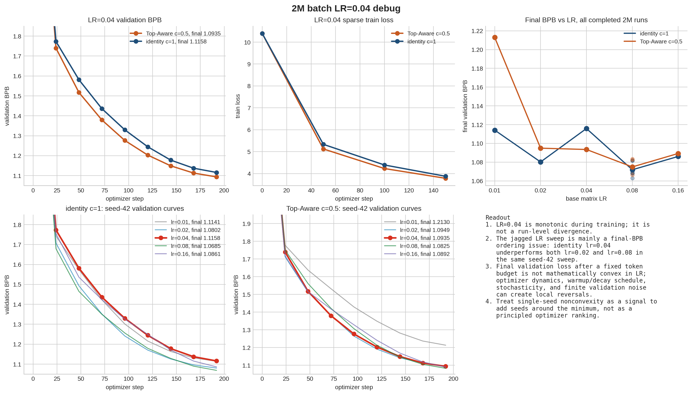
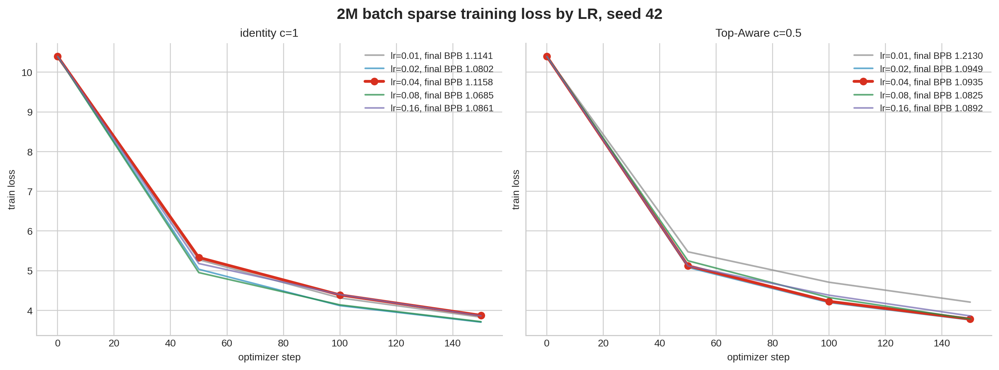

# 2M LR=0.04 Debug

| method | lr | seed | final BPB | source | case |
|---|---:|---:|---:|---|---|
| Top-Aware c=0.5 | 0.01 | 42 | 1.213015 | v44_d8_c05_transition_2m8m | `top_aware_k1_a0p5_bsz2097152_lr0p01_s42` |
| Top-Aware c=0.5 | 0.02 | 42 | 1.094879 | v44_d8_c05_transition_2m8m | `top_aware_k1_a0p5_bsz2097152_lr0p02_s42` |
| Top-Aware c=0.5 | 0.04 | 42 | 1.093475 | v44_d8_c05_transition_2m8m | `top_aware_k1_a0p5_bsz2097152_lr0p04_s42` |
| Top-Aware c=0.5 | 0.08 | 42 | 1.082541 | v44_d8_c05_transition_2m8m | `top_aware_k1_a0p5_bsz2097152_lr0p08_s42` |
| Top-Aware c=0.5 | 0.08 | 42 | 1.083390 | v46_2m_best_metrics | `top_aware_k1_a0p5_bsz2097152_lr0p08_s42` |
| Top-Aware c=0.5 | 0.08 | 43 | 1.066248 | v49_2m_seed_confirm | `top_aware_k1_a0p5_bsz2097152_lr0p08_s43` |
| Top-Aware c=0.5 | 0.08 | 44 | 1.072403 | v49_2m_seed_confirm | `top_aware_k1_a0p5_bsz2097152_lr0p08_s44` |
| Top-Aware c=0.5 | 0.08 | 45 | 1.074180 | v50_2m_seed_confirm_more | `top_aware_k1_a0p5_bsz2097152_lr0p08_s45` |
| Top-Aware c=0.5 | 0.08 | 46 | 1.070616 | v50_2m_seed_confirm_more | `top_aware_k1_a0p5_bsz2097152_lr0p08_s46` |
| Top-Aware c=0.5 | 0.16 | 42 | 1.089224 | v45_d8_2m_lr016_boundary | `top_aware_k1_a0p5_bsz2097152_lr0p16_s42` |
| identity c=1 | 0.01 | 42 | 1.114117 | v44_d8_c05_transition_2m8m | `streaming_identity_bsz2097152_lr0p01_s42` |
| identity c=1 | 0.02 | 42 | 1.080175 | v44_d8_c05_transition_2m8m | `streaming_identity_bsz2097152_lr0p02_s42` |
| identity c=1 | 0.04 | 42 | 1.115813 | v44_d8_c05_transition_2m8m | `streaming_identity_bsz2097152_lr0p04_s42` |
| identity c=1 | 0.08 | 42 | 1.068525 | v44_d8_c05_transition_2m8m | `streaming_identity_bsz2097152_lr0p08_s42` |
| identity c=1 | 0.08 | 42 | 1.067766 | v46_2m_best_metrics | `streaming_identity_bsz2097152_lr0p08_s42` |
| identity c=1 | 0.08 | 43 | 1.062976 | v49_2m_seed_confirm | `streaming_identity_bsz2097152_lr0p08_s43` |
| identity c=1 | 0.08 | 44 | 1.081495 | v49_2m_seed_confirm | `streaming_identity_bsz2097152_lr0p08_s44` |
| identity c=1 | 0.08 | 45 | 1.081773 | v50_2m_seed_confirm_more | `streaming_identity_bsz2097152_lr0p08_s45` |
| identity c=1 | 0.08 | 46 | 1.068684 | v50_2m_seed_confirm_more | `streaming_identity_bsz2097152_lr0p08_s46` |
| identity c=1 | 0.16 | 42 | 1.086051 | v45_d8_2m_lr016_boundary | `streaming_identity_bsz2097152_lr0p16_s42` |
