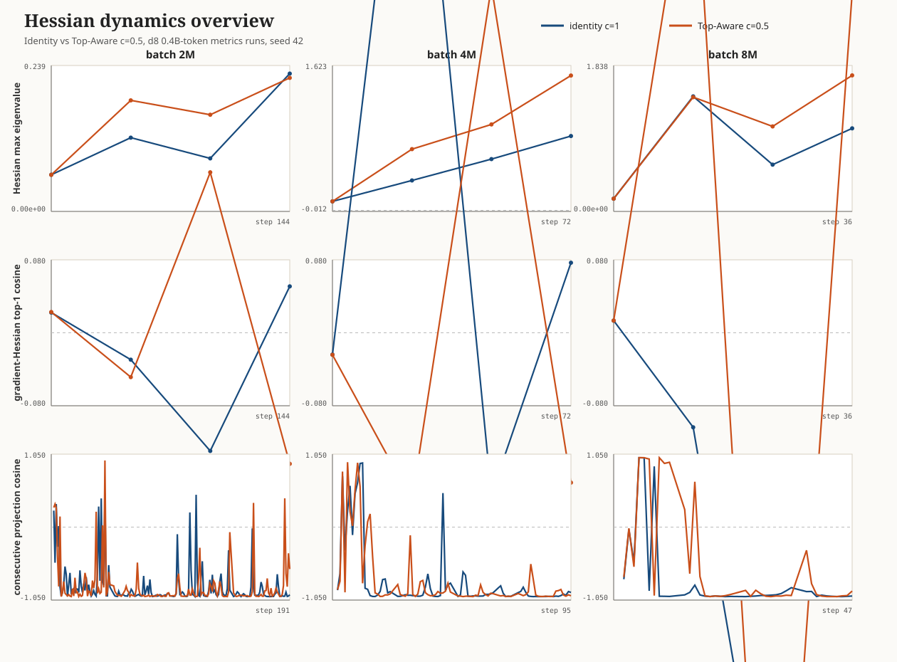

# Hessian Dynamics Overview

| batch | method | val BPB | sharpness probes | grad-Hessian top-1 alignment | projection-corr mean | projection-corr last10 |
|---:|---|---:|---|---|---:|---:|
| 2M | identity c=1 | 1.068 | 0.060, 0.121, 0.087, 0.226 | 0.022, -0.030, -0.130, 0.051 | -0.852 | -0.973 |
| 2M | Top-Aware c=0.5 | 1.083 | 0.060, 0.182, 0.158, 0.219 | 0.023, -0.049, 0.176, -0.144 | -0.859 | -0.686 |
| 4M | identity c=1 | 1.207 | 0.101, 0.335, 0.574, 0.833 | -0.024, 0.710, -0.177, 0.077 | -0.784 | -0.978 |
| 4M | Top-Aware c=0.5 | 1.177 | 0.101, 0.686, 0.962, 1.510 | -0.024, -0.184, 0.380, -0.164 | -0.779 | -0.966 |
| 8M | identity c=1 | 1.450 | 0.161, 1.449, 0.590, 1.046 | 0.013, -0.104, -0.612, -0.446 | -0.787 | -0.981 |
| 8M | Top-Aware c=0.5 | 1.429 | 0.160, 1.439, 1.071, 1.714 | 0.013, 0.556, -0.842, 0.372 | -0.540 | -0.901 |

Read: sharpness is the top selected-subspace Hessian eigenvalue. Gradient-Hessian alignment is the signed cosine with the top Hessian direction. Projection correlation is the cosine between consecutive gradients after projecting both into the most recent Hessian top-k subspace.
