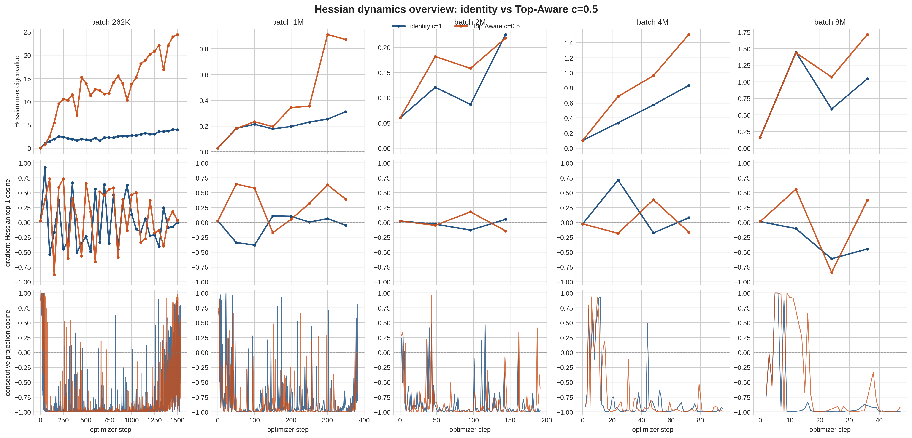

# Hessian Dynamics Overview

| batch | method | val BPB | metric logs | sharpness last | sharpness max | grad-Hessian align last | projection-corr mean | projection-corr last10 |
|---:|---|---:|---:|---:|---:|---:|---:|---:|
| 262K | identity c=1 | 0.967446 | 1536 | 3.945086 | 3.984360 | -3.84e-03 | -0.834783 | -0.034393 |
| 262K | Top-Aware c=0.5 | 0.969429 | 1536 | 24.454258 | 24.454258 | 0.036330 | -0.816524 | -0.045438 |
| 1M | identity c=1 | 1.002178 | 384 | 0.311951 | 0.311951 | -0.049533 | -0.788810 | -0.258321 |
| 1M | Top-Aware c=0.5 | 1.010222 | 384 | 0.871192 | 0.910757 | 0.387333 | -0.849237 | -0.447164 |
| 2M | identity c=1 | 1.067766 | 192 | 0.225555 | 0.225555 | 0.050878 | -0.852489 | -0.972823 |
| 2M | Top-Aware c=0.5 | 1.083390 | 192 | 0.218536 | 0.218536 | -0.143665 | -0.859175 | -0.685824 |
| 4M | identity c=1 | 1.206642 | 96 | 0.833035 | 0.833035 | 0.076807 | -0.783583 | -0.978070 |
| 4M | Top-Aware c=0.5 | 1.176648 | 96 | 1.510028 | 1.510028 | -0.164302 | -0.779139 | -0.965690 |
| 8M | identity c=1 | 1.450463 | 48 | 1.046197 | 1.448756 | -0.446381 | -0.787146 | -0.980575 |
| 8M | Top-Aware c=0.5 | 1.428626 | 48 | 1.714095 | 1.714095 | 0.372316 | -0.539930 | -0.900711 |
