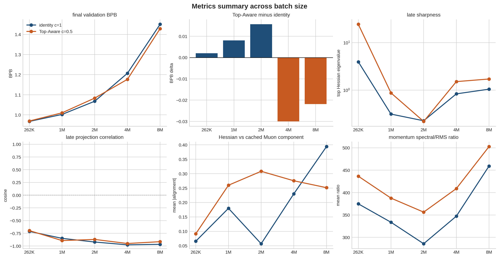
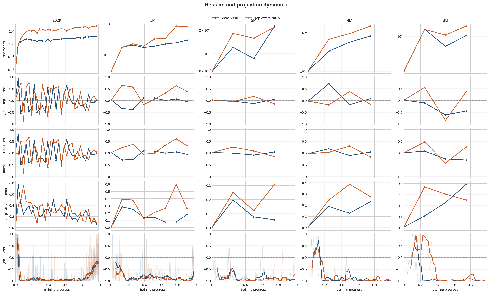
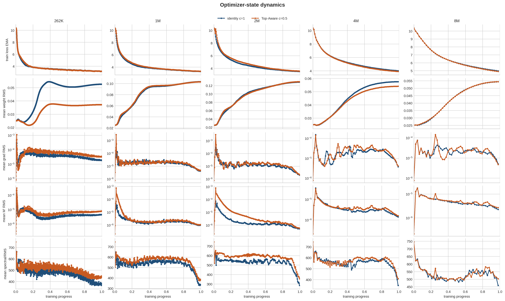

# Metrics Dynamics Analysis

Scope: d8 clean metrics runs comparing StreamingMuon identity `c=1` against Top-Aware Muon `top_k=1, alpha=0.5`. The runs use dense per-step metrics and periodic global Hessian probes. Lower BPB is better.

Generated files:
- `timeseries.csv`: per-step metrics used for plotting.
- `summary.csv`: per-run final and late-window aggregates.
- `metrics_summary_by_batch.png`: cross-batch metric summary.
- `hessian_timeseries_grid.png`: sharpness, Hessian alignment, and projection-correlation dynamics.
- `optimizer_state_timeseries_grid.png`: loss and optimizer-state norm dynamics.

## Main Table

| batch | method | LR | BPB | probes | sharp last | corr late | corr neg frac | grad-H top1 last | mom-H top1 last | Hessian-Muon abs last | spec/RMS last |
|---:|---|---:|---:|---:|---:|---:|---:|---:|---:|---:|---:|
| 262K | identity c=1 | 0.0400 | 0.967446 | 31 | 3.945086 | -0.712262 | 0.942334 | -0.003836 | -0.015747 | 0.065703 | 374.874918 |
| 262K | Top-Aware c=0.5 | 0.0200 | 0.969429 | 31 | 24.454258 | -0.696274 | 0.934193 | 0.036330 | 0.048808 | 0.091491 | 436.560193 |
| 1M | identity c=1 | 0.0800 | 1.002178 | 8 | 0.311951 | -0.848787 | 0.926630 | -0.049533 | -0.049804 | 0.179756 | 333.732889 |
| 1M | Top-Aware c=0.5 | 0.0800 | 1.010222 | 8 | 0.871192 | -0.892428 | 0.961957 | 0.387333 | 0.312409 | 0.259869 | 387.628090 |
| 2M | identity c=1 | 0.0800 | 1.067766 | 4 | 0.225555 | -0.921118 | 0.956522 | 0.050878 | 0.047311 | 0.056971 | 285.791604 |
| 2M | Top-Aware c=0.5 | 0.0800 | 1.083390 | 4 | 0.218536 | -0.870067 | 0.951087 | -0.143665 | -0.152717 | 0.308204 | 356.374448 |
| 4M | identity c=1 | 0.0200 | 1.206642 | 4 | 0.833035 | -0.976139 | 0.909091 | 0.076807 | 0.043004 | 0.230173 | 347.333877 |
| 4M | Top-Aware c=0.5 | 0.0200 | 1.176648 | 4 | 1.510028 | -0.949903 | 0.897727 | -0.164302 | -0.165489 | 0.275317 | 408.964337 |
| 8M | identity c=1 | 0.0200 | 1.450463 | 4 | 1.046197 | -0.966243 | 0.925000 | -0.446381 | -0.295318 | 0.393912 | 459.251241 |
| 8M | Top-Aware c=0.5 | 0.0200 | 1.428626 | 4 | 1.714095 | -0.914273 | 0.800000 | 0.372316 | 0.264849 | 0.251424 | 502.707810 |

## Paired Deltas

| batch | Top-Aware BPB - identity BPB | sharpness ratio Top-Aware / identity | late corr delta |
|---:|---:|---:|---:|
| 262K | 0.001983 | 6.198664 | 0.015989 |
| 1M | 0.008044 | 2.792723 | -0.043641 |
| 2M | 0.015624 | 0.968880 | 0.051051 |
| 4M | -0.029995 | 1.812682 | 0.026236 |
| 8M | -0.021837 | 1.638405 | 0.051970 |

## Figures

## Current Readout

- The metrics runs reproduce the main qualitative batch trend: identity is better at `262K`, `1M`, and `2M`, while Top-Aware is better at `4M` and `8M` in these selected settings.
- Sharpness alone is not a winner predictor. Top-Aware can have larger measured sharpness both where it loses (`262K`, `1M`) and where it wins (`4M`, `8M`).
- The consecutive projection correlation is usually negative, meaning projected gradients often flip direction inside the latest Hessian eigenspace. The least-negative late value is at `8M` Top-Aware, but this does not by itself explain the `4M` improvement.
- Hessian-vs-cached-Muon-component alignment is moderate and batch-dependent. Treat it as a diagnostic for dynamics, not yet as a selection rule.
