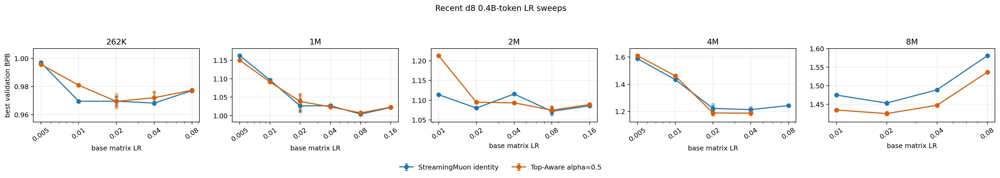
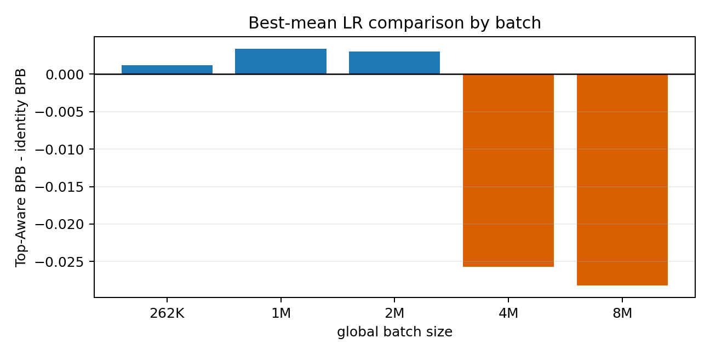

# Recent d8 Sweep Summary

Scope: clean d8 StreamingMuon identity vs Top-Aware Muon `top_k=1, alpha=0.5`, 0.4B-token recipe, sources `v42` through `v58` only. Lower BPB is better.

Generated files:
- `all_runs.csv`: every completed result row used.
- `best_by_mean_lr.csv`: best LR per `(batch, method)` after averaging available seeds at that LR.
- `paired_best_summary.csv`: identity vs Top-Aware comparison by batch.
- `lr_sweep_by_batch.png`: LR curves with seed scatter and mean/error bars.
- `best_delta_by_batch.png`: best Top-Aware minus identity BPB.

## Main Table

| batch | identity best LR | identity BPB | n | Top-Aware best LR | Top-Aware BPB | n | delta | winner |
|---:|---:|---:|---:|---:|---:|---:|---:|---|
| 262K | 0.04 | 0.968216 | 4 | 0.02 | 0.969405 | 4 | +0.001189 | streaming_identity |
| 1M | 0.08 | 1.004064 | 4 | 0.08 | 1.007462 | 4 | +0.003398 | streaming_identity |
| 2M | 0.08 | 1.071870 | 6 | 0.08 | 1.074896 | 6 | +0.003027 | streaming_identity |
| 4M | 0.04 | 1.212967 | 4 | 0.04 | 1.187270 | 4 | -0.025697 | top_aware_muon |
| 8M | 0.02 | 1.453454 | 2 | 0.02 | 1.425232 | 2 | -0.028223 | top_aware_muon |

## Interpretation

- Top-Aware `alpha=0.5` is not uniformly better across the currently swept 0.4B-token d8 recipe.
- The strongest current positive signal is at very large batch (`4M`, `8M`), where Top-Aware wins in the best-mean comparison.
- At `262K`, `1M`, and `2M`, the identity baseline is at least competitive and currently ahead under the best-mean-LR summary.
- Some rows have different seed counts per LR because follow-up boundary/seed-confirm runs were added adaptively; inspect `all_runs.csv` before treating small deltas as final.

## Figures

